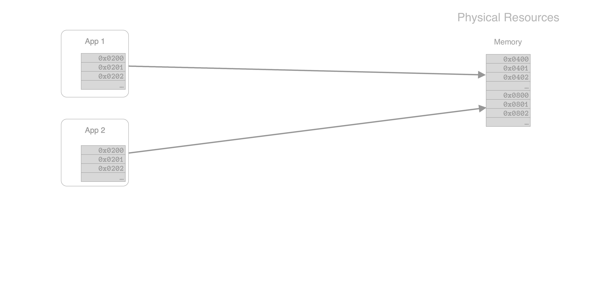
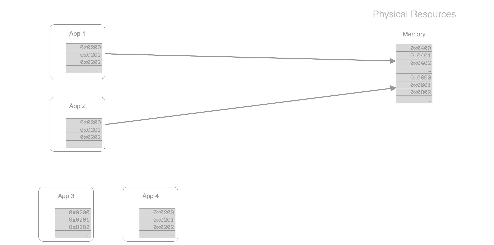
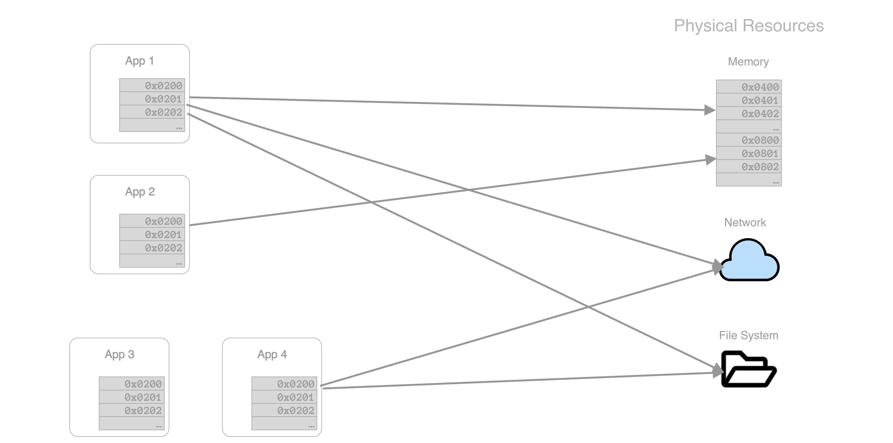
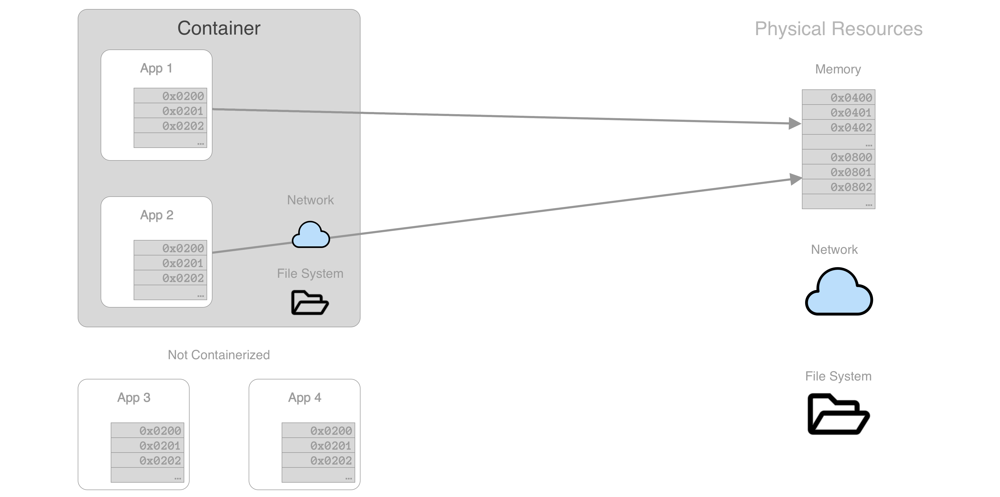

# Container-technology

<small class="fragment">Virtualization of system resources, not hardware virtualization</small>
<small class="fragment">Operating-system-level virtualization</small>

---

# OS Virtualization

<small>Memory virtualization</small>

<small>Memory virtualization</small>

<small>Other physical resources are shared</small>

<small>Containers virtualize fs and network</small>

<small>Processes in containers are still <em>native OS processes</em></small>

Note:

Container technology exists in Linux and Windows

1960s mainframe virtual memory

- the Atlas Supervisor for the Atlas
- THE multiprogramming system for the Electrologica X8 (software based virtual memory without hardware support)
- MCP for the Burroughs B5000
- MTS, TSS/360 and CP/CMS for the IBM System/360 Model 67
- Multics for the GE 645
- the Time Sharing Operating System for the RCA Spectra 70/46

---

# Docker

* Wraps container technology in an easy to use package.  <!-- .element: class="fragment" -->
* Originally for Linux (Mac and Windows runs a virtualized Linux) <!-- .element: class="fragment" -->
* Now also supports native Windows containers <!-- .element: class="fragment" -->

Note:

